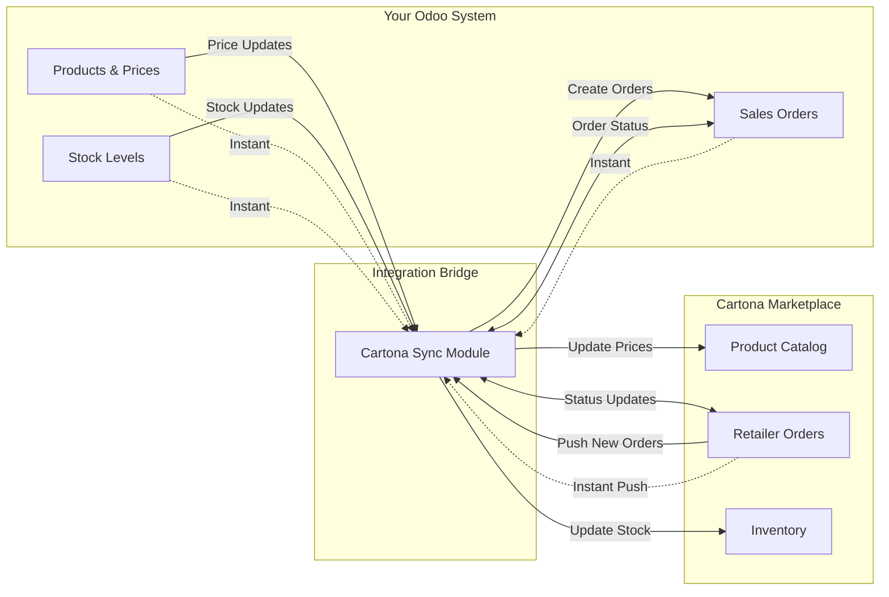

# Cartona-Odoo Integration Module

**Goal:** Enable suppliers using Odoo to expand their market through Cartona marketplace with automated synchronization.

## Project Origins & Problem Statement

### Where This Module Started
**The Real Story**: This integration has a unique origin that explains why it's perfectly positioned for success.

**Cartona's Existing Odoo Setup**:
- Cartona already uses Odoo as their **finance system** for company operations
- **All products from all suppliers** already exist in Cartona's Odoo database
- Cartona has extensive experience with Odoo workflows and architecture

**Strategic Evolution**:
- Cartona decided to **expand beyond being just a marketplace** 
- **New Vision**: Cartona shops would become suppliers themselves
- This meant Cartona would operate as **both marketplace AND supplier**

**The Technical Challenge**:
- Problem: How to separate **all suppliers' products** (already in Odoo) from **Cartona's own shop products** (also in Odoo)?
- Solution: Development team decided to add `cartona_id` column to products table
- Purpose: Identify which products belong to Cartona shops vs other suppliers

**🔑 CRITICAL UNDERSTANDING - The Real Purpose of cartona_id:**
This module is designed for **ALL suppliers that use Odoo** - including Cartona's own shops which are also suppliers in the Cartona marketplace. The `cartona_id` field is the **ONLY mechanism** that distinguishes:
- **Cartona Shop Products** (cartona_id populated) - These sync to marketplace
- **Other Supplier Products** (cartona_id empty) - These remain internal only
- **External Supplier Products** (cartona_id populated when they install this module) - These sync to marketplace

The `cartona_id` field serves as the **universal identifier** that enables any Odoo-based supplier (including Cartona's own shops) to participate in the marketplace ecosystem.

**Birth of the Integration Idea**:
- Once the `cartona_id` solution was implemented for Cartona's internal needs
- The development team realized: "If this works for Cartona shops, why not make it available to ALL suppliers?"
- **Result**: The Cartona-Odoo integration module was born from solving their own internal problem

### The Problem This Feature Solves
**Core Issue**: Suppliers using Odoo ERP face significant barriers when trying to sell on marketplaces:
- **Manual Data Entry**: Having to maintain product catalogs, prices, and inventory in multiple systems
- **Synchronization Errors**: Human mistakes when updating prices or stock levels across platforms
- **Time Consumption**: Constant switching between systems to manage orders and updates
- **Market Access Barriers**: Technical complexity prevents many suppliers from accessing online marketplaces

### Why Target Odoo Suppliers (vs Tabaark, etc.)
**Strategic Decision Based on Internal Success**: 

**Cartona's Odoo Expertise**:
- Cartona already uses Odoo for finance and has deep technical knowledge
- **All supplier products** already exist in their Odoo system
- Internal development team has extensive Odoo experience

**Proven Solution**:
- The `cartona_id` approach was **already tested and working** for Cartona's own shops
- Technical challenges were **already solved** during internal implementation
- **Risk minimization**: Extending a working solution vs building something new

**Natural Market Expansion**:
- **Existing Infrastructure**: Cartona's Odoo already contains supplier data
- **Seamless Integration**: Other Odoo suppliers can use the same proven approach
- **Technical Compatibility**: Same system, same architecture, same best practices

**Market Transformation Goal**: 
- Enable store shops (like Cartona's own shops) to become suppliers on the platform
- Leverage the successful internal model for external suppliers

## What This Module Does

The module connects Odoo with Cartona marketplace through 4 automatic actions:
1. **Price Updates**: When you change prices in Odoo POS → instantly updates Cartona
2. **Stock Updates**: When stock changes in Odoo → instantly pushes updates to Cartona
3. **Order Pull**: When customers order on Cartona → Cartona instantly pushes order to Odoo  
4. **Status Sync**: Order status changes sync instantly between both systems

## Business Benefits

### Strategic Advantages
- **Proven Technology**: Built on Cartona's existing production infrastructure (already handling all supplier data)
- **Risk Mitigation**: Extending a battle-tested solution rather than building from scratch
- **Internal Expertise**: Development team has deep Odoo knowledge from running Cartona's finance system
- **Market Intelligence**: Leverage existing supplier data and market patterns

### Operational Benefits
- **Expand Market Reach**: Access Cartona's growing retailer network instantly
- **Save Time**: Eliminate 10-15 hours/week of manual data entry per supplier
- **Reduce Errors**: Achieve 99%+ accuracy vs error-prone manual processes
- **Real-time Updates**: All changes reflect within 5 seconds across systems

### Financial Impact
- **Revenue Growth**: New suppliers can access markets immediately without technical barriers
- **Cost Reduction**: Suppliers reduce operational overhead significantly
- **Scalability**: Solution works from small suppliers to enterprise-level operations
- **Competitive Edge**: Faster market response and pricing agility

## Integration Overview



### Key Integration Points:
- **🔄 Real-time Push**: All synchronization happens instantly when events occur
- **⚡ Instant Updates**: Price changes, stock updates, new orders, and status changes
- **🔗 Bidirectional**: Order status sync both ways
- **➡️ One-way**: Prices and Stock go from Odoo to Cartona, Orders come from Cartona to Odoo

## How It Works

### 1. Price Updates (Odoo → Cartona)
**Technical Implementation:**
- **Trigger**: Override `write()` method in `product.template` model
- **Detection**: Monitor changes to `list_price` field
- **Processing**: Queue job calls `/api/v1/base-product/bulk-update`
- **Validation**: Ensure product has valid `cartona_id` before sync
- **Error Handling**: Automatic retry with exponential backoff

**User Experience:**
- Change product price in Odoo → price updates on Cartona within 5 seconds
- No additional steps required from users
- Sync status visible in product form view

### 2. Stock Updates (Odoo → Cartona)
**Technical Implementation:**
- **Trigger**: Monitor `stock.quant` changes via `stock.move` completion
- **API Call**: `/api/v1/base-product/bulk-update-stock`
- **Multi-warehouse**: Aggregate stock from all configured locations
- **Validation**: Prevent negative stock scenarios

**User Experience:**
- Stock movements in Odoo → immediate availability updates on Cartona
- Supports purchase receipts, sales deliveries, and inventory adjustments
- Real-time synchronization prevents overselling

### 3. Order Pull (Cartona → Odoo)
**Technical Implementation:**
- **Primary Method**: Cartona pushes orders to webhook endpoint `/cartona_integration/webhook/orders` immediately when orders are created
- **Fallback**: Polling via `/api/v1/orders/pull-orders` every 5 minutes (backup method)
- **Product Matching**: Use `cartona_id` field to link products
- **Customer Creation**: Auto-create customers from retailer data
- **Special Cases**: Handle OTP verification, installments, Cartona credits

**How It Works:**
- Customer places order on Cartona marketplace
- Cartona immediately pushes order data to Odoo via webhook
- Order automatically appears in Odoo Sales module with complete information

**User Experience:**
- Orders appear automatically in Odoo Sales module
- Complete customer information included
- Order lines mapped to correct products
- Special payment terms handled appropriately

### 4. Status Updates (Both Ways)
**Technical Implementation:**
- **Odoo → Cartona**: Monitor `sale.order` state changes
- **API Call**: `/api/v1/orders/update-order-status`
- **State Mapping**: 
  - `draft` → `pending`
  - `sale` → `approved`
  - `done` → `delivered`
- **Cartona → Odoo**: Cartona pushes status updates via webhook when order status changes (similar to order creation)

**User Experience:**
- Order status changes in Odoo automatically update Cartona
- Status changes from Cartona reflect in Odoo sales orders
- Both systems always show consistent order status
- Special handling for OTP delivery confirmation

## Technical Architecture

### Module Structure
```
cartona_integration/
├── __manifest__.py              # Module definition and dependencies
├── models/
│   ├── __init__.py             # Python package initialization
│   ├── product_template.py     # Extend POS products with cartona_id field & price sync
│   ├── product_product.py      # Extend POS product variants with sync logic
│   ├── sale_order.py          # Order status synchronization
│   ├── stock_move.py          # Stock level monitoring & triggers
│   └── cartona_config.py      # API configuration management
├── controllers/
│   ├── __init__.py            # Python package initialization
│   └── cartona_webhook.py     # Handle incoming order & status webhooks
├── views/
│   ├── product_views.xml      # Add cartona_id field to existing POS product views
│   ├── config_views.xml       # Admin configuration interface
│   └── sync_dashboard.xml     # Monitoring and error reporting
├── security/
│   └── ir.model.access.csv    # Access rights and permissions
├── data/
│   └── queue_job_data.xml     # Queue job configuration
└── static/
    └── description/
        ├── icon.png           # Module icon
        └── index.html         # Module documentation
```

### Key Technical Patterns
- **Model Inheritance**: Extend core Odoo models without modification
- **Queue Jobs**: Async processing prevents UI blocking and ensures reliability
- **Webhook Security**: Validate incoming requests with proper authentication
- **Error Recovery**: Automatic retry with exponential backoff and manual intervention options
- **Audit Trail**: Complete logging of all sync operations for troubleshooting

### API Integration Points
- **Product Sync**: `/api/v1/base-product/bulk-update` for prices and stock
- **Order Pull**: `/api/v1/orders/pull-orders` for retrieving new orders
- **Status Updates**: `/api/v1/orders/update-order-status` for order lifecycle management
- **Authentication**: Bearer token authentication with secure credential storage
- Order status changes in Odoo → updates Cartona
- Order status changes in Cartona → updates Odoo
- Both systems stay synchronized

## Next Steps

For detailed implementation guidance, development phases, risk mitigation strategies, and success validation checklists, see the dedicated **[IMPLEMENTATION_GUIDE.md](./IMPLEMENTATION_GUIDE.md)** file.

**Immediate Actions Summary:**
1. **🔑 Obtain sample data from Cartona** (Critical for development)
2. **🏗️ Begin Phase 1: Foundation Setup** (Development ready)
3. **🔗 Secure Cartona API credentials** (High priority)
4. **📋 Finalize remaining technical decisions** (Planning phase)

---

*This document serves as the complete project specification and business context. For implementation details, timelines, and project management guidance, refer to the Implementation Guide.*

## What We Need to Start

### From Cartona:
- API access credentials for testing
- Sample product data
- Test environment access

### Questions to Clarify:
1. ✅ **How should products be matched between Odoo and Cartona?**
   - **RESOLVED**: Products will be matched using a `cartona_id` or `internal_code` field in Odoo products
   - This field will store Cartona's `internal_product_id` to establish the link between systems
   - Need to add this field to `product.template` and `product.product` models in Odoo

2. ✅ **Should price updates happen instantly or in batches?**
   - **RESOLVED**: Price updates will happen instantly
   - When a user changes a product price in Odoo, it triggers immediate sync to Cartona
   - Use Odoo's `write()` method override to detect price changes and call Cartona API instantly

3. What happens when synchronization fails?
4. Do we need approval workflows for price changes?
5. What is the specific event/trigger in Odoo sales orders that should instantly update order status in Cartona?

## Technical Implementation Details

### Product Matching Strategy ✅

**Solution**: Use global `cartona_id` field in Odoo products (designed for universal supplier marketplace access)

**🎯 THE CORE CONCEPT**: 
This module serves **ALL suppliers using Odoo** - including Cartona's own shops. The `cartona_id` field is the **ONLY differentiator** between:
- Products that should sync to Cartona marketplace (cartona_id present)
- Products that remain internal to the supplier's system (cartona_id absent)

This design allows the same module to work for:
- **Cartona's own shops** (already using this system internally)
- **External suppliers** (installing this module to join the marketplace)
- **Any Odoo-based supplier** wanting marketplace access

**Implementation:**
1. **Add new field to Odoo models:**
   - `product.template`: `cartona_id` (Char field) - globally available
   - `product.product`: Inherits from template or has own field for variants
   - **Design Note**: Field is globally accessible but specifically for Cartona supplier products

2. **Field mapping to Cartona API:**
   - Odoo `cartona_id` → Cartona `internal_product_id`
   - This creates a unique link between products in both systems

3. **Sync logic:**
   ```python
   # When syncing from Odoo to Cartona
   cartona_data = {
       "internal_product_id": odoo_product.cartona_id,
       "selling_price": odoo_product.list_price,
       "available_stock_quantity": odoo_product.qty_available,
       # ... other fields
   }
   
   # When importing orders from Cartona to Odoo
   odoo_product = self.env['product.product'].search([
       ('cartona_id', '=', cartona_order_line['internal_product_id'])
   ])
   ```

4. **Data validation:**
   - Ensure `cartona_id` is unique across all products
   - Validate field is populated before attempting sync
   - Handle missing mappings gracefully with error logging

5. **User interface:**
   - Add field to product form view for manual entry
   - Consider bulk import/export tools for initial setup
   - Show sync status indicators on product list views

### Benefits of This Approach:
- **Simple & Reliable**: Direct 1:1 mapping between systems
- **Flexible**: Works with product variants and bundles
- **Maintainable**: Easy to troubleshoot sync issues
- **Future-proof**: Can accommodate changes in either system

### Implementation Considerations:
- **Initial Data Migration**: Need to populate existing products with Cartona IDs
- **New Product Workflow**: Process for assigning Cartona IDs to new products
- **Validation Rules**: Prevent duplicate or invalid Cartona IDs
- **Reporting**: Track which products are/aren't linked to Cartona

### Price Update Strategy ✅

**Solution**: Instant price updates using Odoo model hooks

**Implementation:**
1. **Override `write()` method in product models:**
   ```python
   class ProductTemplate(models.Model):
       _inherit = 'product.template'
       
       def write(self, vals):
           # Store old prices before update
           old_prices = {rec.id: rec.list_price for rec in self}
           result = super().write(vals)
           
           # Check if price changed
           if 'list_price' in vals:
               for record in self:
                   if old_prices[record.id] != record.list_price:
                       # Trigger instant Cartona sync
                       record._sync_price_to_cartona()
           
           return result
   ```

2. **Async processing for reliability:**
   - Use Odoo's queue system (`queue_job`) to handle API calls
   - Prevents blocking the user interface
   - Ensures reliable delivery even if Cartona API is temporarily slow

3. **Real-time validation:**
   - Validate that product has `cartona_internal_id` before syncing
   - Log sync attempts and results
   - Handle API errors gracefully without breaking price updates in Odoo

4. **Sync triggers:**
   - **Product Template**: Changes to `list_price` field
   - **Product Variants**: Changes to variant-specific pricing
   - **Pricelist Updates**: When pricelist rules affect Cartona products

### Technical Benefits:
- **Immediate Market Response**: Price changes reflect instantly on Cartona
- **User-Friendly**: No additional steps required from users
- **Reliable**: Queue system ensures delivery even during high traffic
- **Traceable**: Full audit trail of price sync events

### Implementation Considerations:
- **Bulk Price Updates**: Handle mass price changes efficiently
- **Error Recovery**: Retry failed syncs automatically
- **Performance**: Ensure price updates in Odoo remain fast
- **Monitoring**: Track sync success rates and response times

## User Experience & Success Metrics

### User Workflows

#### **Initial Setup Workflow**
1. **Configuration**: Admin enters Cartona API credentials in Settings
2. **Product Mapping**: Bulk assignment of `cartona_id` to existing products
3. **Testing**: Verify connection and sync a few test products
4. **Go-Live**: Enable real-time synchronization for all products

#### **Daily Operations Workflow**
1. **Price Management**: Users update prices in Odoo → automatic sync to Cartona
2. **Inventory Management**: Stock movements trigger immediate availability updates
3. **Order Processing**: Cartona orders appear automatically in Odoo sales pipeline
4. **Status Tracking**: Order status changes sync bidirectionally without user intervention

#### **Monitoring & Troubleshooting Workflow**
1. **Dashboard Review**: Check sync status and error reports daily
2. **Error Resolution**: Address failed syncs using retry tools and manual intervention
3. **Performance Monitoring**: Track sync times and success rates
4. **Audit Trail**: Review all sync activities for compliance and troubleshooting

## Next Steps

For detailed implementation guidance, development phases, risk mitigation strategies, and success validation checklists, see the dedicated **[IMPLEMENTATION_GUIDE.md](./IMPLEMENTATION_GUIDE.md)** file.

**Immediate Actions Summary:**
1. **🔑 Obtain sample data from Cartona** (Critical for development)
2. **🏗️ Begin Phase 1: Foundation Setup** (Development ready)
3. **🔗 Secure Cartona API credentials** (High priority)
4. **📋 Finalize remaining technical decisions** (Planning phase)
