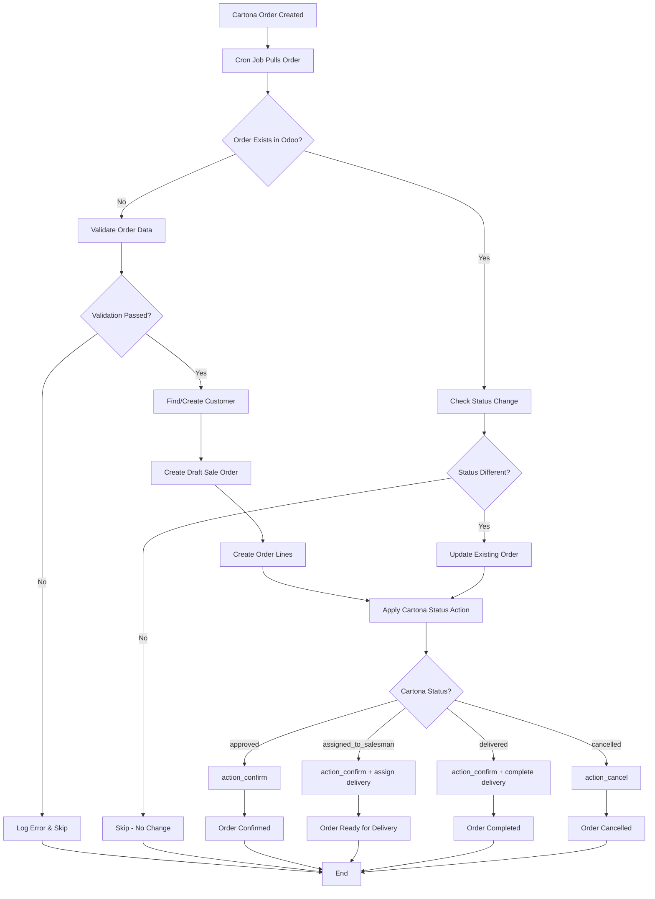
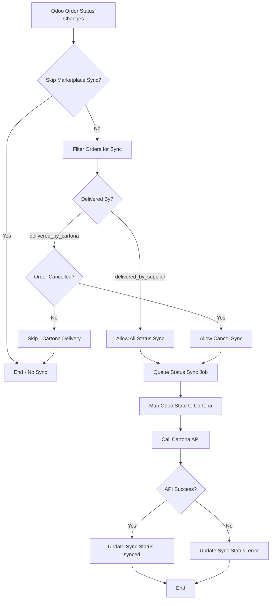
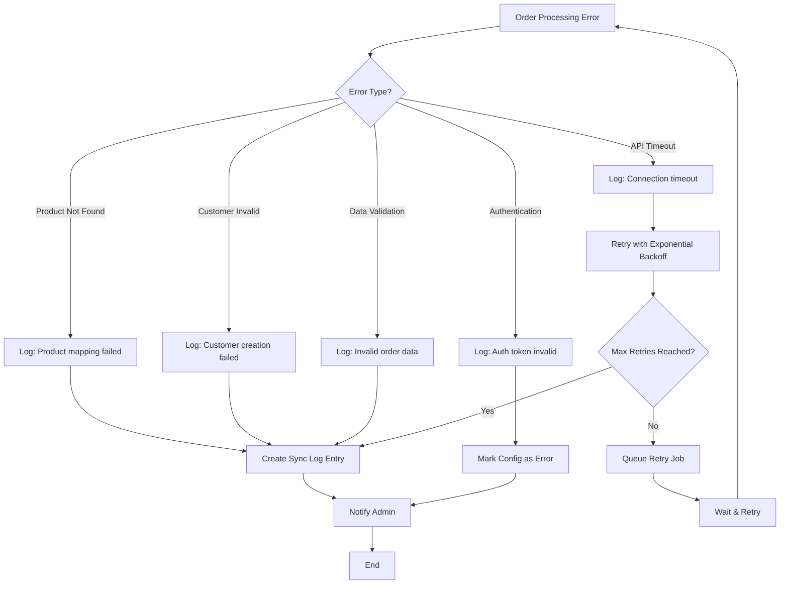

# Cartona Marketplace Integration - Functional Specification

**Document Version:** 1.0  
**Date:** July 17, 2025  
**Audience:** Business Analyst, Product Owner  
**Module Version:** 18.0.1.0.0

---

## 1. Use Case Summary

### What business problem does the module solve?

The Cartona Marketplace Integration module solves the critical challenge of **manual order processing and inventory management** between suppliers and marketplace platforms. Without this integration, suppliers face:

- **Manual Order Entry**: Orders from Cartona must be manually entered into Odoo, leading to delays and errors
- **Inventory Discrepancies**: Stock levels become outdated across platforms, causing overselling or stockouts
- **Status Sync Delays**: Order status updates require manual intervention, affecting customer satisfaction
- **Scalability Issues**: Manual processes cannot handle high order volumes efficiently
- **Data Inconsistency**: Product information becomes fragmented across systems

### Who uses it (Odoo supplier side)?

**Primary Users:**

- **Suppliers/Vendors** who sell products through the Cartona B2B marketplace
- **Inventory Managers** responsible for stock level accuracy across platforms
- **Sales Operations Teams** who process and fulfill marketplace orders
- **Business Owners** who need unified visibility across sales channels

**Installation Model:**

- **One Odoo Instance = One Supplier**
- Each supplier installs this module in their own Odoo system
- Each supplier receives a unique authentication token from Cartona
- Direct connection: Supplier's Odoo ↔ Cartona Marketplace Platform

### What is Cartona, and why is integration needed?

**Cartona** is a B2B marketplace platform that connects suppliers with retailers in emerging markets, particularly in Egypt and the Middle East. It serves as a digital wholesale platform where:

- **Suppliers** list their products and manage inventory
- **Retailers** discover and purchase products in bulk
- **Platform** facilitates transactions, payments, and logistics

**Integration is needed because:**

- **Volume Scale**: Cartona processes thousands of orders daily
- **Real-time Requirements**: Stock levels must be accurate to prevent overselling
- **Operational Efficiency**: Manual processes cannot scale with marketplace growth
- **Customer Experience**: Fast order processing and accurate status updates are essential
- **Business Growth**: Seamless integration enables suppliers to scale their marketplace presence

---

## 2. Process Flows

### Order Lifecycle: Cartona → Odoo

### Status Updates: Cancel, Approve, Deliver

### Error Flow: Mapping Failures

---

## 3. Functional Requirements

### FR-001: Auto-fetch Orders

- **Frequency**: Every 1 minute (configurable via cron job)
- **Scope**: Pull orders from all active marketplace configurations
- **Date Range**: Configurable date range for order retrieval
- **Batch Size**: Process up to 100 orders per batch (configurable)
- **Duplicate Handling**: Skip existing orders, update only if status changed

### FR-002: Create Odoo Sale Order

- **Order Creation**: Create `sale.order` with marketplace-specific fields:
  - `cartona_id`: External order identifier
  - `marketplace_config_id`: Source marketplace reference
  - `marketplace_order_number`: Original marketplace order number
  - `marketplace_status`: Current Cartona status
  - `delivered_by`: Delivery responsibility (supplier/cartona)
  - `marketplace_payment_method`: Payment method used
- **Customer Creation**: Automatically create `res.partner` if not found
- **Order Lines**: Create `sale.order.line` with product mapping

### FR-003: Product Matching

- **Primary Matching**: Match products by `cartona_id` field
- **Fallback Matching**: Use barcode or default_code if cartona_id unavailable
- **External ID Storage**: Store marketplace IDs in dedicated `cartona_id` fields
- **Product Validation**: Validate product exists and is active before order creation

### FR-004: Order State Transitions

- **Draft → Sale**: `action_confirm()` when status = 'approved'
- **Sale → Ready**: `action_confirm()` + assign delivery when status = 'assigned_to_salesman'
- **Ready → Done**: Complete delivery workflow when status = 'delivered'
- **Any → Cancel**: `action_cancel()` when status = 'cancelled'
- **Business Logic**: Respect Odoo's standard order workflow and inventory allocation

### FR-005: Bidirectional Status Sync

- **Odoo → Cartona**: Sync Odoo status changes back to marketplace
- **Delivery Rules**:
  - `delivered_by_supplier`: Sync all status changes
  - `delivered_by_cartona`: Sync only cancellation status
- **Queue Processing**: Use `queue_job` for reliable async processing
- **Error Handling**: Track sync failures and retry mechanism

### FR-006: Logging & Notification

- **Sync Logs**: Create `marketplace.sync.log` entries for all operations
- **Log Types**: success, error, warning, info
- **Operation Types**: product_sync, stock_sync, order_pull, status_sync
- **Error Notifications**: Email/system notifications for critical failures
- **Dashboard**: Sync status monitoring interface

---

## 4. Non-Functional Requirements

### NFR-001: Retry Mechanism

- **Retry Attempts**: Default 3 attempts (configurable)
- **Backoff Strategy**: Exponential backoff for API failures
- **Timeout Handling**: 30-second request timeout (configurable)
- **Queue Recovery**: Failed jobs automatically requeued
- **Max Retry Logic**: Permanent failure after max attempts exceeded

### NFR-002: Secure API Communication

- **Authentication**: Bearer token authentication via `AuthorizationToken` header
- **Token Storage**: Encrypted storage of authentication tokens
- **HTTPS Only**: All API communication over secure connections
- **Connection Testing**: Built-in API connectivity validation
- **Error Masking**: Sensitive data excluded from logs

### NFR-003: Performance Expectations

- **Order Processing**: Process 100+ orders per minute
- **Batch Operations**: Bulk product/stock updates (100 items per batch)
- **Real-time Sync**: Product/stock updates within 5 seconds
- **Memory Usage**: Efficient processing with minimal memory footprint
- **Database Impact**: Optimized queries to prevent database bottlenecks

### NFR-004: Scalability

- **Multi-marketplace**: Support multiple marketplace configurations
- **Queue Management**: Background processing prevents UI blocking
- **Concurrent Processing**: Handle multiple sync operations simultaneously
- **Resource Optimization**: Configurable batch sizes and frequencies

### NFR-005: Monitoring & Observability

- **Health Checks**: Connection status monitoring
- **Performance Metrics**: Sync success rates and processing times
- **Alert System**: Automated notifications for system issues
- **Audit Trail**: Complete log of all marketplace interactions

---

## 5. Limitations

### L-001: Product Mapping Requirements

- **Mandatory External IDs**: Products must have `cartona_id` for proper sync
- **Manual Initial Setup**: First-time product mapping requires manual configuration
- **Barcode Dependency**: Fallback matching relies on accurate barcode data
- **Product Variants**: Complex variant mapping may require manual intervention

### L-002: Order Processing Constraints

- **Cartona Data Format**: Order processing depends on Cartona's specific JSON structure
- **Customer Information**: Limited customer data from marketplace orders
- **Payment Integration**: No direct payment processing (marketplace handles payments)
- **Return Processing**: Return orders require manual handling

### L-003: Delivery Limitations

- **Delivery Tracking**: No integrated tracking for Cartona-delivered orders
- **Inventory Allocation**: Cartona deliveries don't trigger Odoo inventory moves
- **Multi-warehouse**: Limited support for complex warehouse configurations
- **Shipping Methods**: Basic shipping method mapping only

### L-004: Manual Steps Required

- **Initial Configuration**:
  - Marketplace authentication token setup
  - Product cartona_id field population
  - Customer mapping verification
- **Error Resolution**:
  - Failed order processing requires manual review
  - API connection issues need admin intervention
  - Data validation errors require manual correction
- **Monitoring**:
  - Regular review of sync logs recommended
  - Performance monitoring requires periodic checks
  - System health validation needs manual oversight

### L-005: Technical Limitations

- **API Dependencies**: Functionality depends on Cartona API availability
- **Network Requirements**: Stable internet connection required for real-time sync
- **Odoo Version**: Designed for Odoo 18.0 (compatibility with other versions may vary)
- **Queue Job Dependency**: Requires `queue_job` module for background processing
- **Single Tenant**: One Odoo instance serves one supplier only

### L-006: Business Logic Constraints

- **State Mapping**: Fixed mapping between Cartona and Odoo order states
- **Workflow Restrictions**: Cannot override standard Odoo sales workflow
- **Permission Model**: Uses existing Odoo security groups (no custom permissions)
- **Data Sovereignty**: All data processing occurs within supplier's Odoo instance

---

## Configuration Summary

### Required Setup

1. **Install Module**: Install `cartona_integration` module in Odoo
2. **Configure API**: Enter Cartona authentication token and API endpoint
3. **Test Connection**: Validate API connectivity using test button
4. **Map Products**: Populate `cartona_id` fields for products to be synced
5. **Enable Cron Jobs**: Activate automatic order pulling and sync cron jobs

### Optional Configuration

- **Sync Frequencies**: Adjust cron job intervals based on business needs
- **Batch Sizes**: Modify batch processing limits for performance optimization
- **State Mapping**: Customize marketplace-to-Odoo status mapping if needed
- **Notification Settings**: Configure error notification recipients

This functional specification provides a complete overview of the Cartona Marketplace Integration module's capabilities, limitations, and requirements for successful implementation and operation.
